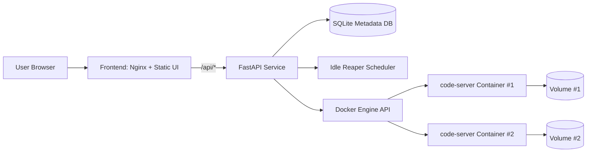

# Cloud IDE Platform

Production-oriented platform to provision isolated browser-based VS Code workspaces on demand.

## Why This Project

This system demonstrates end-to-end software engineering across backend design, container orchestration, frontend operations UX, CI/CD, and production hardening.

🚀 **Live Demo:** https://rolled-kyle-queen-stylish.trycloudflare.com/

## 🎥 Demo

https://github.com/vanshgoel123/cloud-ide-platform/blob/main/Built%20my%20own%20Cloud%20IDE%20Platform%20%E2%98%81%EF%B8%8F%F0%9F%92%BB%20Launch%20browser-based%20coding%20environments%20in%20one%20click%20%F0%9F%9A%80%20(2).mp4

## Core Features

- One-click workspace provisioning using Dockerized code-server
- Persistent per-workspace storage via Docker volumes
- Start/stop/delete/purge lifecycle APIs
- Idle reaper to auto-stop inactive workspaces
- Workspace dashboard (frontend + API proxy via Nginx)
- Health and metrics endpoints (`/health`, `/metrics`)
- Rate limiting for workspace creation
- Optional API key protection for mutation endpoints

## Architecture



## Tech Stack

- Backend: FastAPI, Pydantic v2, APScheduler, Docker SDK, Prometheus client
- Frontend: HTML/CSS/Vanilla JS, Nginx
- Data: SQLite (single-node metadata)
- DevOps: Docker Compose, GitHub Actions (lint/test/build/push)

## Repository Structure

```text
api/
  app/
    main.py             # API endpoints, middleware, metrics, rate limiting
    db.py               # SQLite schema + queries
    docker_manager.py   # Docker runtime lifecycle wrapper
    idle_reaper.py      # Background idle cleanup scheduler
    schemas.py          # Request/response models
    config.py           # Environment-backed settings
  Dockerfile
  requirements.txt
frontend/
  index.html
  app.js
  styles.css
  nginx.conf
tests/
  test_api.py
docker-compose.yml
.github/workflows/main.yml
```

## Local Development

### Prerequisites

- Docker + Docker Compose
- Linux/macOS recommended for Docker socket compatibility

### Run

```bash
cp .env.example .env
# IMPORTANT: set a secure VS_PASSWORD before using publicly
docker compose up -d --build
```

### Verify

```bash
curl -s http://localhost:8000/health | jq .
curl -s http://localhost:8000/metrics | head
```

Frontend dashboard: `http://localhost:3000`

## API Overview

Base URL: `http://localhost:8000`

- `POST /api/workspaces` create workspace (returns bootstrap token)
- `GET /api/workspaces` list workspace metadata (token hidden)
- `GET /api/workspaces/{id}` workspace details
- `POST /api/workspaces/{id}/start` start or restore
- `POST /api/workspaces/{id}/stop` stop runtime (keep data)
- `POST /api/workspaces/{id}/heartbeat` mark active
- `DELETE /api/workspaces/{id}` soft delete
- `DELETE /api/workspaces/{id}?purge=true` hard delete + volume purge
- `GET /health` liveness
- `GET /metrics` Prometheus metrics

### Auth Model (Current)

- Read endpoints are open by default.
- If `API_KEY` is configured, mutation endpoints require header:

```text
X-API-Key: <your-api-key>
```

## Configuration

| Variable | Default | Purpose |
|---|---|---|
| `API_PORT` | `8000` | API publish port |
| `WEB_PORT` | `3000` | Frontend publish port |
| `DOMAIN` | `localhost` | Workspace URL domain |
| `VS_IMAGE` | `codercom/code-server:latest` | Runtime image |
| `VS_CPU_LIMIT` | `0.5` | CPU cores per workspace |
| `VS_MEM_LIMIT` | `512m` | Memory limit per workspace |
| `VS_IDLE_TIMEOUT_MIN` | `30` | Auto-stop timeout |
| `VS_PASSWORD` | `change-me` | code-server password |
| `API_KEY` | empty | Optional mutation auth |
| `CORS_ALLOW_ORIGINS` | `*` | CORS allowlist |
| `RATE_LIMIT_WINDOW_SEC` | `60` | Rate limit window |
| `RATE_LIMIT_CREATE_PER_WINDOW` | `5` | Max creates/window/IP |

## Production Deployment Notes

This repo is currently optimized for **single-node deployment**. For production:

- Put API + frontend behind TLS ingress (Nginx/Traefik/ALB)
- Do not expose workspace ports directly on public internet without access controls
- Replace static `VS_PASSWORD` model with per-workspace secret/token flow
- Use managed Postgres instead of SQLite for concurrency + durability
- Move reaper into a dedicated worker/cron component
- Add centralized logs + tracing + alerting
- Restrict Docker socket access or isolate runtime orchestration service

## CI/CD

GitHub Actions pipeline:

- Lint + tests on PRs
- Build frontend image validation on PRs
- Build and push API image on `main` pushes

## Observability

- Health checks in API and frontend containers
- Prometheus metric: `cloudide_workspace_operations_total{operation,outcome}`

## Security Considerations

Current repo improvements include:

- Token no longer exposed in list/details APIs
- Optional API key auth gate for mutation operations
- Input validation for workspace user IDs
- Basic frontend security headers
- Safer Docker runtime exception handling

Still recommended before internet-scale exposure:

- OAuth/JWT with user-scoped authorization
- Per-workspace signed access URL or reverse proxy auth
- Secret manager integration (not `.env` in runtime)
- Network policies and egress restrictions

## Demo Section

Add your live links here before sharing on resume:

- Live App: `<your-live-frontend-url>`
- Live API Docs: `<your-live-api-url>/docs`
- Metrics Endpoint (protected/internal): `<your-live-api-url>/metrics`
- Short Demo Video/GIF: `<link>`

## Screenshots

Add screenshots to `docs/images/` and link here:

- Dashboard overview
- Workspace lifecycle actions
- Running code-server instance

## Future Enhancements

- Redis-backed distributed rate limiter and caching
- Queue-based provisioning workers (Celery/RQ + Redis/RabbitMQ)
- Multi-tenant RBAC and quotas per user/org
- Reverse proxy per-workspace subdomain routing
- Snapshot/restore for workspace volumes
- Horizontal API scaling with shared datastore
